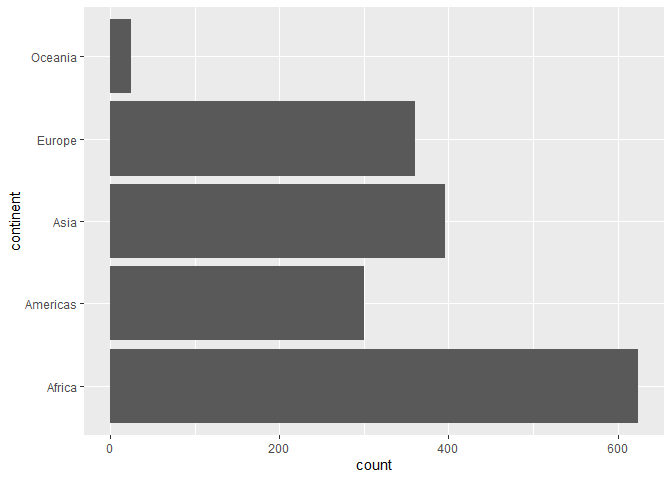
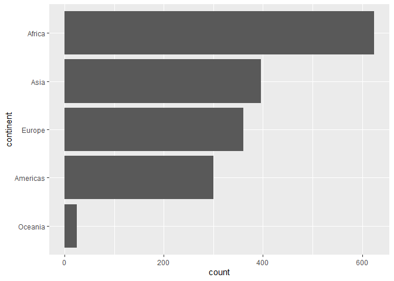
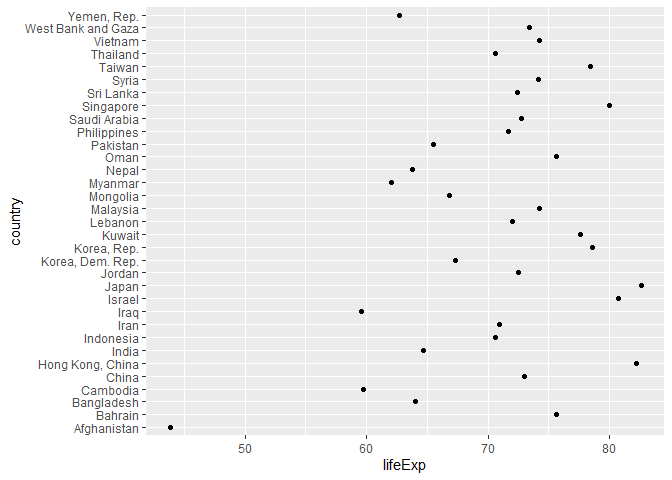
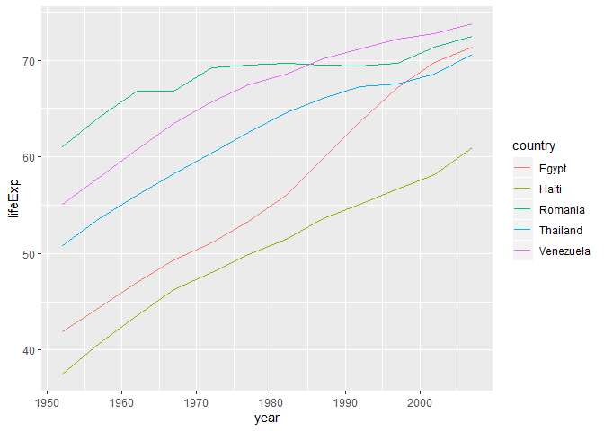
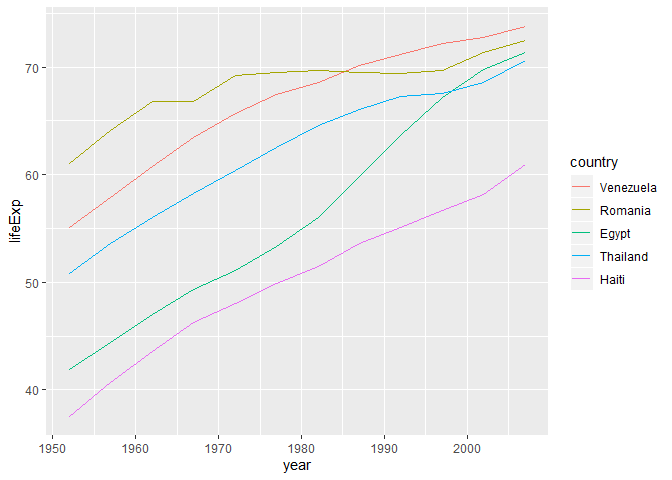

# Exploratory Data Analysis: Taking Control of Your Factors

Requirements:

- GitHub account
- RStudio Cloud account

Goals:

- Wrangle data that is stored as factor levels

**Pick a lead**:
This person is not solely responsible for doing the activity, but they are responsible for organizing the collective team effort - for example, making sure all parts are completed and pushing them to the Team GitHub repo.

## Introduction

As Jenny Bryan says, "The worst kind of factor is the stealth factor."
Factor variables are character variables that are actually stored as integers.
The levels of character string variables are human-friendly in that they are easy for us to read, but R (and other programming languages) are actually storing them as integer codes.

Base R has a desire to turn character variables into factors, but we will explore factor variables using the `forcats` package of the `tidyverse`.

This activity is based on Jenny Bryan's [STAT 545](https://stat545.com/) factor notes.

## Getting started

We are still relying on only one Team Member (the lead) pushing the complete activity, but the others are expected to contribute to the discussion and help the lead member complete the step, but not *push* the files from their computer (they should be able to pull, though).

1. *All* Team Members:
  - Go to the Documents section on [Bb](https://mybb.gvsu.edu)
  - Click on the link titled `activity0206`
  - Click on the "Join" button next to your corresponding team name in the **Join an existing team** section
2. *All* Team Members now will:
  - In your team repo, click the green **Clone or download** button, select "Use HTTPS" if this isn't the default option, and click on the clipboard icon to copy the repo URL
  - Go to RStudio Cloud and into the course workspace.  Create a **New Project from Git Repo** - remember that you need to click on the down arrow next to the **New Project** button to see this option.
  - Paste the URL of your activity repo into the dialogue box.
  - Click "OK".
3. *All* Team Members now will Load Package:
  - In this lab, we will work with the `tidyverse` and `gapminder` packages so we need to install and load them.
    Type the following code into your *Console*:
  
    
    ```r
    install.packages("tidyverse")
    library(tidyverse)
    ```
    
    
    ```r
    install.packages("gapminder")
    library(gapminder)
    ```
    
  - Note that this package is also loaded in your R Markdown document.
4. *All* Team Members now will configure Git:
  - Go to the *Terminal* pane and type the following two lines of code, replacing the information inside the quotation marks with your GitHub account information:
  
    
    ```bash
    git config --global user.email "your email"
    git config --global user.name "your name"
    ```
    
  - Confirm that these changes have been implemented, run the following code:
  
    
    ```bash
    git config --global user.email
    git config --global user.name
    ```
        
  - Inform git that you want to store your GitHub credentials for $60 \times 60 \times 24 \times 7 = 604,800$ seconds, run the next line of code.  This needs to be done on a per-project basis.
  
    
    ```bash
    git config --global credential.helper 'cache --timeout 604800'
    ```
    
5. *All* Team Members will now name their RStudio project:
  - Currently your RStudio project is called *Untitled Project*.  Update the name of your project to be "Activity 2-6 - Merging"
6. The *Lead* Team Member to do the following in RStudio:
  - Open the `.Rmd` file and update the **YAML** by changing the author name to your **Team** name and date to today, then knit the document.
  - Go to the *Git* pane and click on **Diff** to confirm that you are happy with the changes.
  - *Stage* just your Rmd file, add a commit message like "Updated team name" in the *Commit Message* dialogue box and click **Commit**
  - Click on **Push**.  This will prompt a dialogue where you first need to enter your GitHub user name, and then your password - this should be the only time you need to do this for the current activity.
  - Verify that your changes have been made to your GitHub repo.
7. *All other* Team Members now will do the following in RStudio:
  - Go to the *Git* pane and click on **Pull** button.  This will prompt a dialogue where you first need to enter your GitHub user name, and then your password (this should be the only time you need to do this for the current activity).
  - Observe that the changes are now reflected in their project!

Again, only one team member will be pushing the changes.
All others are encouraged to work and save changes "locally" in RStudio.Cloud, but not push.

## The data

You should be very comfortable with the `gapminder` data at this point.

***
**Exercise 1**:
Explore the `gapminder#continent` variable using the `str`, `levels`, `nlevels`, and `class` functions.
Summarize what information these functions provide.
What is the default ordering of the continent levels?
Does this make sense or is there a better way to display these?

***

Using the `forcats` function `fct_count()`, we can obtain a frequency table.


```r
fct_count(gapminder$continent)
```

```
## # A tibble: 5 x 2
##   f            n
##   <fct>    <int>
## 1 Africa     624
## 2 Americas   300
## 3 Asia       396
## 4 Europe     360
## 5 Oceania     24
```

***
**Exercise 2**:
Recreate this table using your `dplyr` skills.

***

## Dropping unused levels

There are many countries in the `gapminder` data set.


```r
nlevels(gapminder$country)
```

```
## [1] 142
```

Suppose that we only wanted to explore data from the following countries.


```r
h_countries <- c("Egypt", "Haiti", "Romania", "Thailand", "Venezuela")
```

***
**Exercise 3**:
*Filter* the the `gapminder` data set to only focus on these five countries and store this as `h_gap`.
Then, check the number of levels of the `country` variable in the `h_gap` data set.
What issues do you see with this?

***

It would be nice to be able to drop all of the unused factor levels.
Using your `h_gap` data set, this could be accomplished using the base function `droplevels()` (which operates on all the factors in a data frame or on a single factor) or the `forcats::fct_drop()` wich operates on a factor.


```r
## Use droplevels() on a data frame (or can be a single factor)
h_gap_droplevels <- h_gap %>% 
  droplevels()
nlevels(h_gap_dropped$country)

## Use forcats::fct_drop() on a single factor
h_gap$country %>% 
  fct_drop() %>% 
  levels()
```

***
**Exercise 4**:
Filter the `gapminder` data down to rows where the population is less than a quarter of a million (i.e., 250,000).
Get ride of the unused factor levels for country and continent.
Explore this using the following ways:

1. The base function `droplevels()`,
2. `fct_drop()` inside `mutate()`,
3. `fct_drop()` with `mutate_ at()`, and
4. `fct_drop()` with `mutate_if()`

***

## Change the order of levels

As you saw in Exercise 1, the default factor levels are ordered alphabetically.
Usually, there is some prefered order to the levels:

- By frequency - make the most common level the first, and so on.
- Another variable - order factor levels according to a summary statistic for another variable.
  For example, we might want to order the gapminder countries by life expectancy.

We have seen some ways to do these within `dplyr`.
First, we will order continent by frequency (forwards and backwards).
Often, this is prefered for tables and figures (e.g., bar plots).


```r
## default order is alphabetical
gapminder$continent %>%
  levels()
```

```
## [1] "Africa"   "Americas" "Asia"     "Europe"   "Oceania"
```

```r
## order by frequency
gapminder$continent %>% 
  fct_infreq() %>%
  levels()
```

```
## [1] "Africa"   "Asia"     "Europe"   "Americas" "Oceania"
```

```r
## backwards!
gapminder$continent %>% 
  fct_infreq() %>%
  fct_rev() %>% 
  levels()
```

```
## [1] "Oceania"  "Americas" "Europe"   "Asia"     "Africa"
```

These two bar charts different only by the ordering of the continents.
Which do you prefer?


```r
p <- ggplot(gapminder, aes(x = continent)) +
  geom_bar() +
  coord_flip()
p
gap_tmp <- gapminder %>% 
  mutate(continent = continent %>% fct_infreq() %>% fct_rev())
p <- ggplot(gap_tmp, aes(x = continent)) +
  geom_bar() +
  coord_flip()
p
```



Now you will order `country` by another variable, forwards and backwards.
When we seek to do this, the other variable is usually quantitative and the factor variable is ordered according to a grouped summary.
For example:


```r
## order countries by median life expectancy
fct_reorder(gapminder$country, gapminder$lifeExp) %>% 
  levels() %>% head()
```

```
## [1] "Sierra Leone"  "Guinea-Bissau" "Afghanistan"   "Angola"       
## [5] "Somalia"       "Guinea"
```

```r
## order accoring to minimum life exp instead of median
fct_reorder(gapminder$country, gapminder$lifeExp, min) %>% 
  levels() %>% head()
```

```
## [1] "Rwanda"       "Afghanistan"  "Gambia"       "Angola"      
## [5] "Sierra Leone" "Cambodia"
```

```r
## backwards!
fct_reorder(gapminder$country, gapminder$lifeExp, .desc = TRUE) %>% 
  levels() %>% head()
```

```
## [1] "Iceland"     "Japan"       "Sweden"      "Switzerland" "Netherlands"
## [6] "Norway"
```

Usually when we want to reorder factor levels is to make a plot easier to understand.
When a factor is mapped to the $x$ or $y$ axes, it should almost always be reordered by the quantitative variable you are mapping to the other axis.


```r
gap_asia_2007 <- gapminder %>% filter(year == 2007, continent == "Asia")
ggplot(gap_asia_2007, aes(x = lifeExp, y = country)) + geom_point()
```

<!-- -->

***
**Exercise 5**:
Improve the above plot of life expectancy in Asian countries in 2007.
Briefly describe what you notice or wonder from your improved plot.

***

Note: When you have a line chart of a quantitative $x$ against another quantitative $y$ and your factor provided color, use `fct_reorder2()`.
This will make the legend appear in the same order as the data.


```r
h_countries <- c("Egypt", "Haiti", "Romania", "Thailand", "Venezuela")
h_gap <- gapminder %>%
  filter(country %in% h_countries) %>% 
  droplevels()
ggplot(h_gap, aes(x = year, y = lifeExp, color = country)) +
  geom_line()
ggplot(h_gap, aes(x = year, y = lifeExp,
                  color = fct_reorder2(country, year, lifeExp))) +
  geom_line() +
  labs(color = "country")
```



## Change order of levels

Sometimes you may just want to bring one or more levels to the front.
We did something similiarly in `dplry` with moving certain variables to the first few columns.


```r
h_gap$country %>% levels()
```

```
## [1] "Egypt"     "Haiti"     "Romania"   "Thailand"  "Venezuela"
```

```r
h_gap$country %>% fct_relevel("Romania", "Haiti") %>% levels()
```

```
## [1] "Romania"   "Haiti"     "Egypt"     "Thailand"  "Venezuela"
```

## Recode the levels

Sometimes you have a better idea of what certain levels should be.
This is called recoding.


```r
i_gap <- gapminder %>% 
  filter(country %in% c("United States", "Sweden", "Australia")) %>% 
  droplevels()

i_gap$country %>% 
  levels()
```

```
## [1] "Australia"     "Sweden"        "United States"
```

```r
i_gap$country %>%
  fct_recode("USA" = "United States", "Oz" = "Australia") %>% 
  levels()
```

```
## [1] "Oz"     "Sweden" "USA"
```

***
**Exercise 6**:
Isolate the data for `"Australia"`, `"Korea, Dem. Rep."`, and `"Korea, Rep."` in the 200X's.
Revalue the country factor levels to `"Oz"`, `"North Korea"`, and `"South Korea"`.

***

## Grow a factor

First let's create two data frames, each with two countries, and drop the unused factor levels.


```r
df1 <- gapminder %>%
  filter(country %in% c("United States", "Mexico"), year > 2000) %>%
  droplevels()
df2 <- gapminder %>%
  filter(country %in% c("France", "Germany"), year > 2000) %>%
  droplevels()
```

Notice that the `country` factors in `df1` and `df2` have different levels.


```r
levels(df1$country)
```

```
## [1] "Mexico"        "United States"
```

```r
levels(df2$country)
```

```
## [1] "France"  "Germany"
```

Base R won't let us simply combine the two collection of levels.


```r
c(df1$country, df2$country)
```

```
## [1] 1 1 2 2 1 1 2 2
```

However, `forcat::fct_c()` can!


```r
fct_c(df1$country, df2$country)
```

```
## [1] Mexico        Mexico        United States United States France       
## [6] France        Germany       Germany      
## Levels: Mexico United States France Germany
```


***
**Exercise 7**:
Explore how different forms of row binding behave here for `df1` and `df2`, in terms of the `country` variable in the results.

1. Using `bind_rows()`, and
2. Using `rbind()`

Briefly describe what you notice.

***

Have your **Lead Team Member** commit and push the final activity to your Team's repo.

